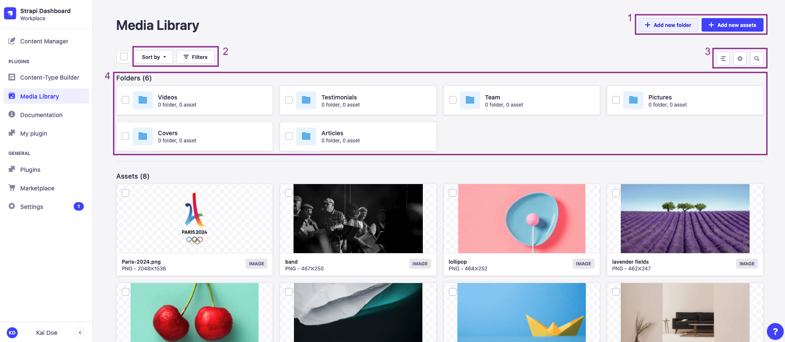

# Introduction to the Media Library

The Media Library is a Strapi plugin that is always activated by default and cannot be deactivated. It is accessible both when the application is in a development and production environment.

Administrators can access the Media Library from  _Media Library_ in the main navigation of the admin panel.

The Media Library displays all assets uploaded in the application, either via the Media Library itself or via the Content Manager when managing a media field. Assets uploaded to the Media Library can be inserted into content-types using the [Content Manager](/user-docs/latest/content-manager/writing-content.md#filling-up-fields).

From the Media Library, it is possible to:

- upload a new asset (see [adding assets](/user-docs/latest/media-library/adding-assets.md)) or create a new folder (see [organizing assets with folders](/user-docs/latest/media-library/organizing-assets-with-folders.md)) (1),
- sort the assets and folders or set filters (2) to find assets and folders more easily,
- toggle between the list view  and the grid view  to display assets, and make a textual search (3) to find a specific asset or folder,
- and view, navigate through, and manage folders (4).

::: tip
Click the search icon  on the right side of the user interface to use a text search and find one of your assets or folders more quickly!
:::

## Filtering assets

Right above the list of folders and assets, on the left side of the interface, a **Filters** button is displayed. It allows setting one or more condition-based filters, which add to one another (i.e. if you set several conditions, only the assets that match all the conditions will be displayed).

To set a new filter:

1. Click on the **Filters** button.
2. Click on the 1st drop-down list to choose the field on which the condition will be applied.
3. Click on the 2nd drop-down list to choose the type of condition to apply.
4. For conditions based on the type of asset to filter, click on the 3rd drop-down list and choose a file type to include or exclude. For conditions based on date and time (i.e. _createdAt_ or _updatedAt_ fields), click on the left field to select a date and click on the right field to select a time.
5. Click on the **Add filter** button.

::: note
When active, filters are displayed next to the **Filters** button. They can be removed by clicking on the delete icon .
:::

## Sorting assets

Just above the list of folders and assets, on the left side of the interface, a **Sort by** button is displayed. It allows to display assets by upload date, alphabetical order or date of update. Click on the button and select an option in the list to automatically display the sorted assets.
